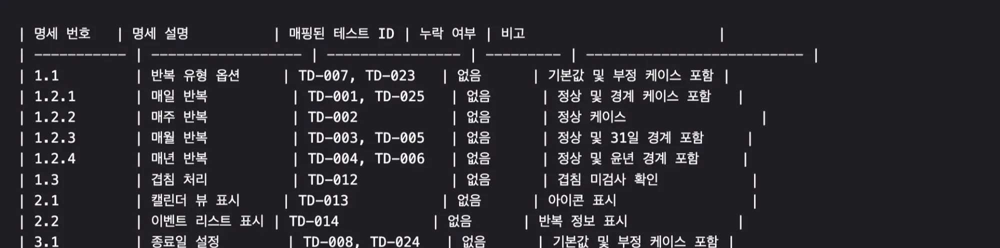

# AI와 테스트를 활용한 안정적인 기능 개발 리포트

## 사용하는 도구를 선택한 이유가 있을까요? 각 도구의 특징에 대해 조사해본적이 있나요?

- Codex : CLI 형태로 제공되어 Cursor 등에서 함께 사용이 가능했습니다. 논리/로직에 강하고 의도를 최우선으로 파악하기 때문에 제일 처음 프롬프트 초안을 만드는데 사용하였습니다.

- Cursor(VS Code 기반 AI 코드 에디터) : .cursor/rules 폴더를 통해 프로젝트별 규칙을 체계적으로 관리할 수 있습니다. 각 단계별 프롬프트 파일(step01~step06)을 참조하여 일관된 워크플로우를 유지할 수 있었습니다. 이는 단순히 채팅으로 지시하는 것보다 훨씬 구조화된 개발 프로세스를 가능하게 했습니다. 목요일에 커서2.0으로 업그레이드 되며 기존에 사용하던 프롬프트가 정확히 동작하지 않고 작업내용은 좀 더 친절하게 보여주지만 오타라든가 자잘한 오류가 많이 발견되었습니다 ㅠ 배포된 날이라 안정화가 덜 된 것 같아보였습니다. 이후 Kiro에서 진행하였습니다.

- Kiro : Cursor와 동일하게 AI 코드 에디터로 .kiro/steering 폴더를 통해 프로젝트 전반에 적용되는 가이드라인을 설정 가능합니다. spec 문서를 만들고, spec 기반으로 구현하는데 특화되어 있습니다. 프롬프트에 명시된 내용대로 수행하는게 cursor보다 강했고, 사용자에게 markdown을 보여주는 view 형태는 표가 깨지는 경우가 많았습니다.

## 테스트를 기반으로 하는 AI를 통한 기능 개발과 없을 때의 기능개발은 차이가 있었나요?

#### 1. 예외케이스에 대한 검증 강화

반복 일정처럼 날짜, 윤년, 31일 등 경계가 많은 케이스에서 테스트가 방패 역할을 해 일관된 동작을 보장했습니다.

#### 2.명세-테스트-구현 일관성

테스트 기반(RED→GREEN)으로 진행하니 AI 개발이 “테스트 가능성”을 기준으로 진행되어, 과도한 범위 확장을 방지했습니다. 테스트를 먼저 작성하고 "이 테스트를 통과시키는 최소 구현"을 요청하면, AI는 정확히 테스트가 요구하는 범위 내에서만 코드를 작성했습니다. docs/test_design/002_recurring_events_test_design.md에 정의된 26개의 테스트 케이스가 명확한 경계선 역할을 했습니다.

#### 3. 산출물

개발이 산출물 기준으로 명확하게 구현되었음을 보장할 수 있었습니다. 명세서의 어떤 요구사항이 어떤 테스트로 커버되는지를 명확히하고 누락된 요구사항이 없는지 확인하고 해당 부분만 테스트와 구현을 할 수 있었습니다.

## AI의 응답을 개선하기 위해 추가했던 여러 정보(context)는 무엇인가요?

#### **1. TDD 사이클 오케스트레이터 (tdd-cycle-automation.mdc) 도입**

전체적인 흐름을 가이드하고 용어와 단계들을 일관되게 인지할 수 있도록 통일시켰습니다.

- 자동 감지: "TDD:" 또는 "spec:"으로 시작하는 메시지를 감지하여 자동으로 6단계 프로세스 시작
- 단계 체이닝: 각 단계 완료 후 자동으로 다음 단계로 진행 (STEP01 → STEP02 → ... → STEP06)
- 요약 표 강제: 각 단계 말미에 반드시 요약 표를 화면에 표시하도록 규칙 설정
- 커밋 : 각 단계 완료 시 반드시 git 커밋을 실행하도록 강제

이 오케스트레이터는 AI가 "다음에 무엇을 해야 하는지"를 명확히 알 수 있게 했고, 사용자 개입 없이도 전체 TDD 사이클을 자동으로 진행할 수 있게 했습니다.

#### **2. 스텝별 실행 규칙 (.cursor/tdd/step0x\_\*.md)**

각 단계마다 상세한 프롬프트 파일을 작성하여 산출물 형식, 파일 경로, 금지/권장 패턴, 요약 표 형식, 커밋 메시지 컨벤션까지 제공했습니다.

```
STEP03 (테스트 작성 - RED) 단계에서는:
  테스트 파일 경로: src/__tests__/unit/ 또는 src/__tests__/integration/
  테스트 코드만 작성하고 구현 코드는 빈 껍데기만 생성
  echo "q" | pnpm test [파일명]으로 RED 상태 확인
  테스트 실패 메시지를 확인하여 올바르게 실패하는지 검증

STEP04 (기능 구현 - GREEN) 단계에서는:
  테스트 코드 수정 절대 금지 - RED 단계에서 작성한 테스트를 변경하면 안됨
  프로젝트 구조 규칙 참조 필수 (.cursor/rules/00. foundation/project_structure)
  최소 구현 원칙: 테스트를 통과시키는 데 필요한 최소한의 코드만 작성
```

이러한 명확한 규칙들이 AI가 각 단계에서 정확히 무엇을 해야 하는지 이해하도록 도왔습니다.

#### **3. 명세 문서 (docs/project_spec/)**

- 기능 명세와 테스트 명세서는 .md 파일로 작성하게 하고 파일 산출물에 대해서는 샘플을 제공하였습니다.
- 스펙 문서: 001_calendar_system.md, 002_recurring_events.md에 요구사항을 “번호”로 제공하도록 하여 번호가 각 스텝별로 이어지도록 하였습니다.

#### **4. 공통 Rule제공**

- 라이브러리/버전 제약: Vitest/Testing Library, MSW, React/MUI 버전 스펙을 고정해, AI가 호환 API만 쓰도록 유도하였습니다.
- 코드·커밋 컨벤션과 src구조를 제공하여 AI가 프로젝트의 흐름을 파악하고 진행할 수 있도록 하였습니다.

## 이 context를 잘 활용하게 하기 위해 했던 노력이 있나요?

#### **1. 각 스텝별 프롬프트 파일에 참고해야 할 파일 정보를 고정으로 노출**

각 단계의 프롬프트 파일 상단에 필수 참조 규칙을 명시했습니다

```
**⚠️ 필수 규칙 참조 (매 단계 적용)**: 이 단계 실행 전 반드시 다음 규칙을 읽고 준수

- [코드 컨벤션](mdc:.cursor/rules/00. foundation/code_conventions.mdc)
- [커밋 컨벤션](mdc:.cursor/rules/00. foundation/commit_conventions.mdc)
- [프로젝트 구조](mdc:.cursor/rules/00. foundation/project_structure.mdc)
```

이를 통해 AI가 매 단계마다 일관된 규칙을 참조하도록 강제했습니다.

#### **2. 역할을 1~2줄로 명확히 부여**

각 단계의 역할을 간결하게 정의했습니다

```
STEP01: "사용자가 입력한 기능 명세를 분석하여 구조화된 spec 문서를 생성합니다."
STEP02: "STEP01에서 작성된 최신 명세서를 테스트 관점으로 구조화해, STEP03에서 바로 구현 가능한 테스트 설계 문서를 완성합니다."
STEP03: "테스트 설계 문서를 기반으로 실패하는 테스트 코드를 작성합니다. (RED 상태)"
STEP04: "실패하는 테스트를 통과시키기 위해 필요한 최소한의 기능 구현을 수행합니다. (GREEN 상태)"
STEP05: 통과한 테스트를 유지한 채 코드 품질을 개선합니다. 테스트가 깨지지 않도록 안전하게 리팩토링합니다.
STEP06: 명세서에 정의된 모든 기능이 실제로 구현되었는지 최종 검증합니다
```

이러한 명확한 역할 정의가 AI가 각 단계의 목적을 이해하고 범위를 벗어나지 않도록 했습니다.

#### **3. Few-shot 및 템플릿 제공**

- 매핑 테이블을 샘플로 제공하여 AI가 "명세 1.2.3을 구현할 때는 TD-003과 TD-005를 통과시켜야 한다"는 것을 명확히하였습니다.

  ```
  docs/test_design/002_recurring_events_test_design.md의 "3-1. 명세-테스트 매칭 목록" 섹션:

  | 명세 번호 | 명세 설명 | 매핑된 테스트 ID | 누락 여부 | 비고 | |-----------|----------|-----------------|----------|------| | 1.2.3 | 매월 반복 | TD-003, TD-005 | 없음 | 정상 및 31일 경계 포함 | | 1.2.4 | 매년 반복 | TD-004, TD-006 | 없음 | 정상 및 윤년 경계 포함 |
  ```

  

- 각 단계 마지막에 요약 표를 "표시하지 않으면 종료 불가"로 정의해, 에이전트가 매 단계 산출물을 표 형식으로 정돈하도록 하였습니다.

  ```
  # 📋 STEP03 테스트 작성 요약

  | 항목             | 내용                                          |
  | ---------------- | --------------------------------------------- |
  | 설계 문서 파일   | docs/test_design/###\*기능명\_test_design.md  |
  | 테스트 파일      | `src/__tests__/unit/[파일명].spec.ts`         |
  |                  | `src/__tests__/integration/[파일명].spec.tsx` |
  | 테스트 케이스 수 | [N]개                                         |
  | 테스트 상태      | 실패 (RED) - 의도된 미구현                    |
  | 다음 단계        | 4️⃣ 기능 구현 (GREEN)                          |
  ```

  

#### **4. 프로젝트 구조·경로·파일명 규칙 고정**

```
**⚠️ 프로젝트 구조 참고 (필수)**: `.cursor/rules/00. foundation/project_structure` 파일을 읽어 파일 배치 규칙 확인
- 기능이 배치될 위치 확인 (`src/features/`, `src/components/`, `src/utils/`, `src/services/` 등)
- 파일명 규칙 및 디렉터리 구조 이해
- 기존 패턴과 일관성 유지
```

AI가 "이 유틸리티 함수는 src/utils/에 배치해야 한다", "이 커스텀 훅은 src/hooks/에 배치해야 한다"는 것을 자동으로 판단하도록 했습니다.

#### **5. 실행 규칙을 절차로 명확하게 가이드 하고 금지항목을 명확히 표기**

```
**⚠️ 금지 사항**:
- **테스트 코드 수정 절대 금지** - RED 단계에서 작성한 테스트를 변경하면 안됨
- 테스트 코드는 건드리지 않고 구현 코드만 작성

**테스트 실행**: `echo "q" | pnpm test [파일명]`으로 지정한 파일만 실행
```

이러한 명확한 경계 설정이 AI가 TDD의 핵심 원칙(테스트를 먼저 작성하고 고정한 후, 구현 코드만 변경)을 지키도록 강제했습니다. 실제로 이 규칙이 없었을 때는 AI가 테스트를 통과시키기 위해 테스트 코드 자체를 수정하는 경우가 있었는데 이후로는 RED 단계에서 스텁만 구현하고 Green 단계에서 실제 구현이 수행되었습니다.

#### **6. 테스트 실행 명령도 구체적으로 명시**

```
**테스트 실행**: `echo "q" | pnpm test [파일명]`으로 지정한 파일만 실행하고 자동 종료
```

이를 통해 AI가 watch 모드로 테스트를 실행하여 프로세스가 멈추는 문제를 방지하고, 특정 파일만 테스트하여 빠른 피드백을 받을 수 있도록 했습니다.

#### **7. 필요 시 적절한 이모티콘 사용**

금지, 강조 등에 문구보다는 이모티콘을 사용하여 프롬프트 길이를 줄이고 AI가 좀 더 직관적으로 인지할 수 있도록 하였습니다.

## 생성된 여러 결과는 만족스러웠나요? AI의 응답을 어떤 기준을 갖고 '평가(evaluation)'했나요?

### 평가 기준

#### 1. 명세-테스트 매칭

- docs/test_design/002_recurring_events_test_design.md의 "명세 vs 테스트 커버리지"와 "명세-테스트 매칭 목록"에서 누락 없음을 확인했습니다. 이렇게 각 명세 항목이 최소 하나 이상의 테스트로 커버되는지 확인했습니다.
  

#### 2. 케이스 분포·우선순위 (Risk-based Testing)

- High/Medium/Low 분포가 리스크에 비례하는지, unit/integration 비율이 적절한지 통계로 산출하였습니다.
- 복잡한 날짜 계산 로직은 unit 테스트로 빠르게 검증하고, 다이얼로그 표시나 아이콘 렌더링 같은 UI 동작은 integration 테스트로 검증하였습니다.
  

#### 3. 컨벤션 준수 (Code Quality)

- 파일명·경로·언어 규칙(한글/영어), import 순서·테스트 위치 등 일관성을 점검했습니다.
  ```
  체크리스트:
  ✅ 파일 경로: src/utils/recurringEvents.ts, src/__tests__/unit/recurringEvents.spec.ts
  ✅ 파일명 규칙: camelCase.ts, PascalCase.tsx
  ✅ 언어 규칙: 주석과 문서는 한글, 코드는 영어
  ✅ import 순서: React → 외부 라이브러리 → 내부 모듈 → 타입
  ✅ 커밋 메시지: feat(td-green): implement recurring events generation
  ```

## AI에게 어떻게 질문하는것이 더 나은 결과를 얻을 수 있었나요? 시도했던 여러 경험을 알려주세요.

#### 1. "작업 단위+출력 형식"을 명확히

- "STEP02 요약 표를 먼저 화면에 출력하고, 그 다음 문서를 저장해."처럼 순서·형식을 고정했습니다.

  ```
    1. docs/test_design/002_recurring_events_test_design.md 파일을 읽어서 TD-005 테스트를 분석하세요.
    2. src/utils/recurringEvents.ts에 generateMonthlyRecurrence 함수를 구현하세요.
    3. echo "q" | pnpm test src/__tests__/unit/recurringEvents.spec.ts를 실행하여 TD-005가 통과하는지 확인하세요.
    4. 통과하면 STEP04 요약 표를 화면에 표시하세요.
    5. git commit을 실행하세요.
  ```

  

- "매월 반복 기능을 구현해주세요."이렇게 막연하게 요청하면, AI가 어디서부터 시작해야 할지, 어떤 파일을 수정해야 할지, 어떻게 검증해야 할지 불명확하여 결과물의 품질이 떨어졌습니다.

#### 2. 파일 경로·이름·스펙 번호·TD-ID를 함께 제공

AI가 탐색 없이 바로 매칭/생성할 수 있도록 구체적인 정보를 제공했습니다.

```
명세 1.2.3 "매월 반복"에 대한 TD-005 테스트를 구현하세요.
- 테스트 파일: src/__tests__/unit/recurringEvents.spec.ts
- 테스트 ID: TD-005
- 기대 결과: 7개 일정 생성 (1월, 3월, 5월, 7월, 8월, 10월, 12월 31일)
- 실패 신호: 2월, 4월, 6월, 9월, 11월에 일정 생성됨
```

#### 3. 금지/제약을 포함

config 수정 금지, 테스트 코드 수정 금지 등 경계가 분명할수록 결과가 안정적이었습니다.

```
다음 규칙을 반드시 준수하세요:
- ❌ 테스트 코드 수정 금지 (src/__tests__/ 폴더의 파일은 절대 수정하지 마세요)
- ❌ vite.config.ts, tsconfig.json 같은 설정 파일 수정 금지
- ✅ src/utils/recurringEvents.ts 파일만 수정하세요
```

이러한 명확한 제약이 AI가 범위를 벗어나는 것을 방지했습니다. 실제로 초기에는 AI가 테스트를 통과시키기 위해 테스트 코드 자체를 수정하거나, 설정 파일을 변경하여 다른 테스트가 깨지는 문제가 있었습니다.
아래 이미지는 AI 답변인데 금지 제약을 통해 AI가 임의 단계에서 테스트 코드를 수정하는 것을 방지하였습니다.


#### 4. "리스크를 선제적으로 리스트업"

31일/윤년/ID 충돌처럼 놓치기 쉬운 포인트를 맨 앞 컨텍스트에 배치했습니다.

```
매월 반복 기능을 구현할 때 다음 리스크를 반드시 고려하세요:
⚠️ 31일 문제: 31일에 매월 반복을 선택하면 31일이 없는 달(2월, 4월, 6월, 9월, 11월)은 건너뛰어야 합니다.
⚠️ 윤년 문제: 2월 29일에 매년 반복을 선택하면 평년에는 생성되지 않아야 합니다.
⚠️ ID 충돌: 각 반복 인스턴스는 고유한 ID를 가져야 합니다. 형식: ${originalId}_${YYYY-MM-DD}
```

## AI에게 지시하는 작업의 범위를 어떻게 잡았나요? 범위를 좁게, 넓게 해보고 결과를 적어주세요. 그리고 내가 생각하는 적절한 단위를 말해보세요.

**넓게 잡았을 때**

- "반복 일정 기능 전체"를 한 번에 요구
- 산출물 다양성은 높음: AI가 다양한 반복 유형, UI 컴포넌트, 유틸리티 함수를 한 번에 생성
- 오류 발생에 대해 정확한 원인을 짚어내지 못하고 다시 오류를 발생시키는 문제가 생김

**좁게 잡았을 때**

- 시도: "명세 1.2.3, TD-005만 RED→GREEN"
- 정확성 높음: 해당 케이스에 대해서는 완벽하게 구현
- 디버깅 용이: 문제 발생 시 범위가 좁아 빠르게 파악
- 단계 과다: 지나치게 미세한 단위로 나누면 단계가 과도하게 늘어남
- 문맥 전환 비용: 매번 새로운 컨텍스트를 로드하고 이전 작업을 상기해야 함
- 중복 작업: 유사한 패턴을 여러 번 반복 구현

**적절한 단위**

- 유사한 기능을 묶어 한번에 지시하되 단계와 세부사항에 대해 명확히 요청해야합니다.
- 관련된 기능을 한 번에 구현하여 문맥 전환 비용 감소
- 핵심 리스크(31일, 윤년)를 함께 처리하여 누락 방지

## 동기들에게 공유하고 싶은 좋은 참고자료나 문구가 있었나요? 마음껏 자랑해주세요.

**"컨텍스트는 AI의 기억이다"**

AI는 대화 히스토리를 기억하지만, 프로젝트 전체의 맥락을 이해하려면 구조화된 컨텍스트가 필요합니다. .cursor/rules/, docs/project_spec/, docs/test_design/ 같은 체계적인 문서 구조가 AI의 "장기 기억" 역할을 했습니다.

**"금지 규칙이 자유를 준다"**

역설적이게도, "테스트 코드 수정 금지", "config 파일 수정 금지" 같은 명확한 제약이 AI가 더 창의적이고 정확한 구현을 하도록 도왔습니다. 경계가 명확할수록 AI는 중요한 것에 집중할 수 있었습니다.

**1. 명세-테스트-구현의 완벽한 추적성**

- 명세 번호 → 테스트 ID → 구현 파일 → 커밋 메시지까지 일관된 추적이 가능했습니다.
  ```
  명세 1.2.3 "매월 반복"
  → TD-005 "31일 매월 반복 생성"
  → src/utils/recurringEvents.ts의 generateMonthlyRecurrence 함수
  → 커밋: feat(td-green): implement monthly recurrence with 31-day edge case
  이러한 추적성 덕분에 "이 기능이 왜 이렇게 구현되었는지", "어떤 테스트가 이를 검증하는지"를 즉시 파악할 수 있었습니다.
  ```
  

**2. 37개 테스트 케이스, 100% 커버리지**

- 반복 일정 기능에 대해 체계적인 테스트 케이스를 설계하고, 모든 명세 항목을 빠짐없이 커버했습니다.

  - 정상 케이스 16개: 핵심 기능이 의도대로 동작하는지 검증
  - 경계 케이스 7개: 31일, 윤년, 시작일=종료일 같은 까다로운 상황 처리
  - 예외 케이스 1개: 종료일이 시작일보다 이전인 경우 에러 처리
  - 부정 케이스 2개: 잘못된 입력에 대한 방어 로직

  이러한 체계적인 테스트 설계 덕분에 구현 후 발생한 버그에 대해 테스트 케이스를 명확히 해가며 수정할 수 있었습니다.
  

**3. 자동화된 TDD 워크플로우**

- "TDD: 반복 일정 기능"이라고 한 줄만 입력하면, 6단계 프로세스가 자동으로 실행되어:
  ```
  명세서 생성 (docs/project_spec/002_recurring_events.md)
  테스트 설계 (docs/test_design/002_recurring_events_test_design.md)
  테스트 코드 작성 (RED)
  기능 구현 (GREEN)
  리팩토링
  최종 검증
  ```
  각 단계마다 요약 표를 표시하고, git 커밋을 자동으로 실행하여 진행 상황을 추적할 수 있었습니다.
  
  

## AI가 잘하는 것과 못하는 것에 대해 고민한 적이 있나요? 내가 생각하는 지점에 대해 작성해주세요.

**잘하는 것**

- 번호 있는 명세 → 테스트 케이스 표 → 테스트 코드 골격 생성
- 규칙 기반 반복 작업(파일 배치, 경로, 템플릿 유지)
- 최소 구현 코드 합성(RED를 GREEN으로 빠르게 전환)

**약한 것**

- 달력/시간처럼 경계가 많은 도메인에서 “암묵적 규칙”이 빠지기 쉬움(31일/윤년 등) → 스펙/테스트에 명시 중복 필요
- UI-상태-데이터 간 일관성(단일/전체 수정·삭제 다이얼로그 흐름)에서 세부 인터랙션 누락 가능 → 통합 테스트로 보완해야 함
- 최신 라이브러리 미세 문법 차이. → 버전 스펙을 컨텍스트에 고정하고, API 호환성 규칙을 명시

## 마지막으로 느낀점에 대해 적어주세요!
무엇보다 TDD로 진행하니 기능 테스트를 하는데 있어서 부담이 덜했고, AI가 문제 있는 부분을 스스로 찾아서 해결하는 부분이 인상깊었습니다.

1. 테스트 코드가 개발 범위를 명확하게 만들었습니다.
명세를 가지고 기능 구현부터 진행했다면 어디까지 구현되었고 누락된 부분이 무엇인지 확인하기 어려웠을 것입니다. 하지만 테스트 코드를 먼저 작성하니 개발 범위가 명확해졌습니다.
특히 GREEN 단계에서 실제 코드를 구현할 때 테스트 코드를 계속 돌려가며 진행하니,지금 무엇을 구현하고 있는지 명확하고, 어떤 테스트가 통과되었고 무엇이 남았는지 한눈에 파악되고 구현 완료 기준이 명확해서 오류를 조금은.. 편하게.. 확인할 수 있었습니다.

3. 명확한 spec + TDD 
그동안은 프롬프트로 진행하기보다는 건건이 오류 해결하기에 급했습니다. AI가 코드를 생성하면 오류가 나고, 오류를 고치면 또 다른 오류가 나는 악순환이었습니다. 하지만 이번 경험을 통해  AI와 개발할 때 명확한 spec작성과 TDD방식으로 개발하는 것도 괜찮겠다는 생각이 들었습니다.

3. AI의 수정 범위를 명확히 제한해야 한다
한번 정신을 놓기 시작하면 AI가 어디를 수정하는지 모르게 다른 소스에도 영향을 끼치게 수정합니다.
실제로 A 기능을 수정하라고 했는데 B, C 파일까지 건드리거나, 테스트를 통과시키려다 테스트 코드 자체를 수정, 설정 파일을 변경하여 전체 프로젝트에 영향을 주는 등이 발생했습니다. "이 파일만 수정", "테스트 코드 수정 금지", "설정 파일 수정 금지" 같은 명확한 경계를 설정하니 AI가 범위를 벗어나는 일이 크게 줄었습니다.

